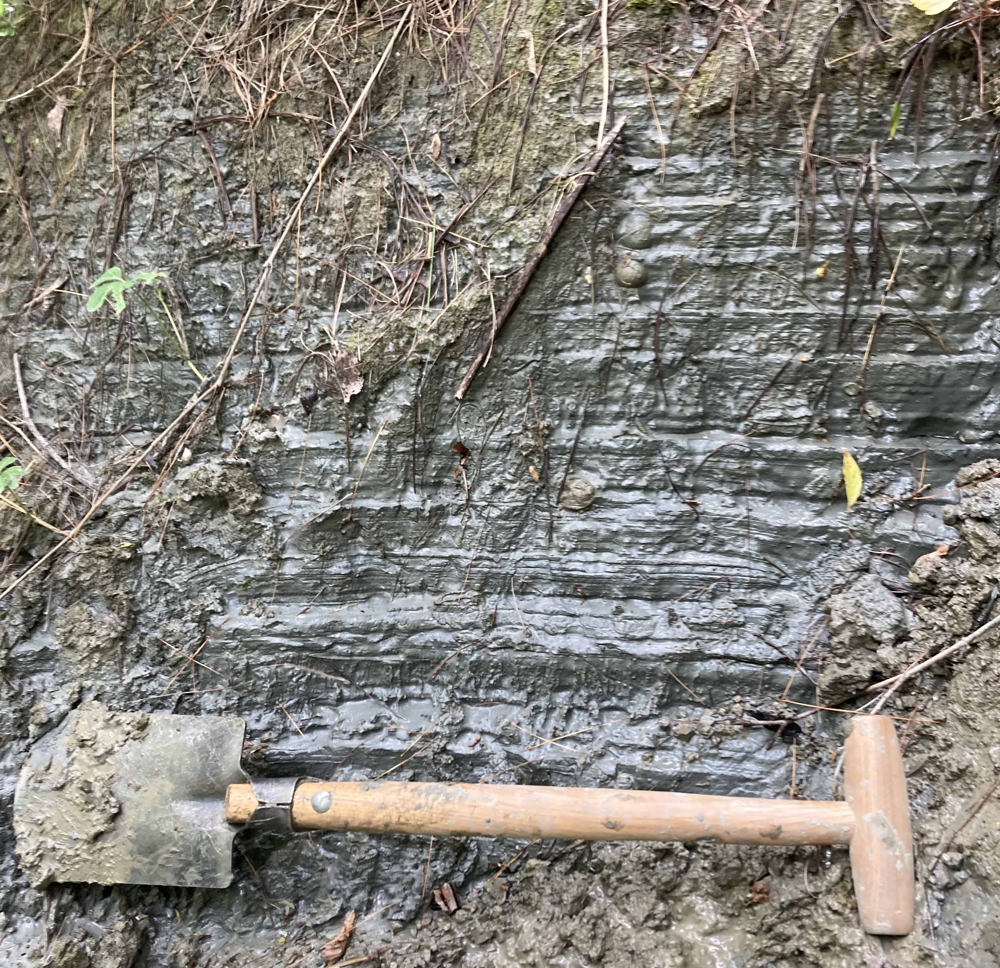

Welcome to the Geochemistry & Radioisotope Analytical and Computation Laboratory (GRACkLe) website! We are a part of the [Department of Earth & Environmental Geosciences](https://www.trinity.edu/academics/departments/earth-and-environmental-geosciences) at [Trinity University](https://trinity.edu).

We study how Earth's [environments have changed over the Quaternary period](#quaternary--climate-science) (the last 2.58 million years) as well as the [earliest stages of our solar system](#planetary-science--cosmochemistry), using  a variety of geochemical (geology&nbsp;+&nbsp;chemistry) and computational (computers&nbsp;+&nbsp;math) techniques. 

The headings below give a very brief overview of our interests.

## Quaternary &amp; climate science

We study the chemistry of rocks and soils to reconstruct climate and environmental change over the Earth's recent past. Our questions focus on the environments beneath and at the periphery of ice sheets during episodes of glacial change, to better understand how ice sheets expand and collapse.

## Planetary science &amp; cosmochemistry

We study the chemistry of meteorites from the asteroid belt (between Jupiter and Mars), which are the debris of the first, planet-like objects to form at the dawn of our solar system. Through studying this ancient detritus, we discern the formation of the solar system and its first planetary bodies.

   
  Image: <a href="https://www.jpl.nasa.gov/images/pia07854-band-of-rubble-artist-concept/" style="font-size:15px;"> NASA JPL</a>

## Science education &amp; outreach

Scientific knowledge is useless if we cannot share it with others. Open, community-oriented science education is as important as the new understandings we gain from our research. Learn more by clicking the [Outreach](../_pages/outreach.md) menu tab above!

