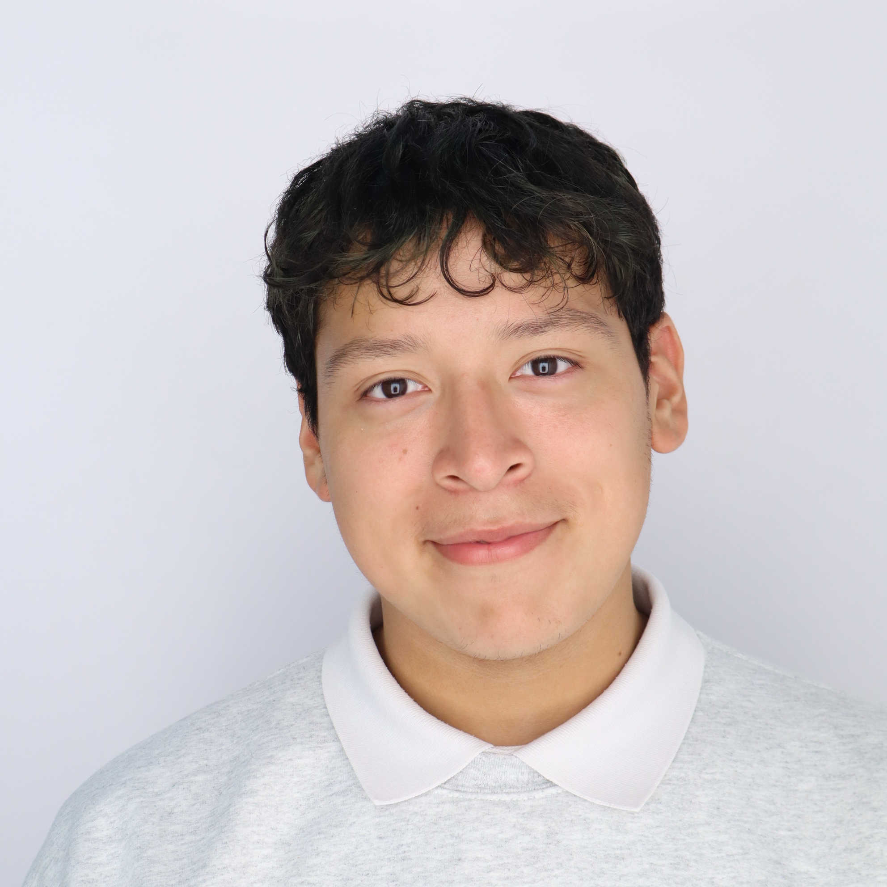
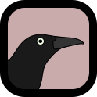
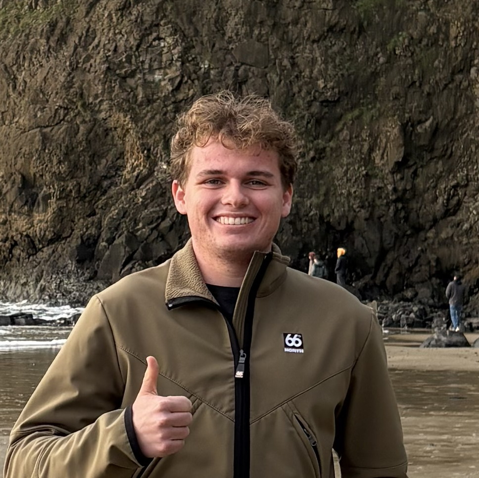
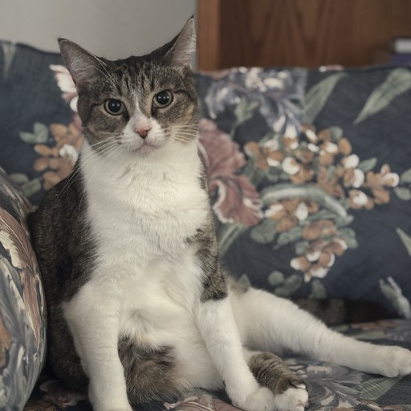

## Primary Investigator

  <a href="https://grahamedwards.github.io">

</a>
  
 
  <strong>Graham Harper Edwards</strong> 
  <em>Assistant Professor</em> 
  Interests: glaciers, water, soils, meteorites, time
  

## Student Researchers

  

  
 
    <strong>Julio Melara</strong> 
    Interests: CaCO3, planetary health, education
  

  

  
 
    <strong>Erin Rodriguez</strong> 

  

  

  
 
    <strong>Ian Strang</strong> 
    Interests: rocks, prehistoric landscapes and environments, bad jokes
  

### Alumni

  
 
    <strong>Emma <q>Rose</q> Garrett</strong> (2026)
  

  
 
    <strong>Luke Moreton</strong> (2026)
  

## Associates

  

  
 
  <strong>Chef Kennedy Edwards</strong> 
  <em>Cat</em> 
  Interests: clay, kibble, rest, the hunt.
  

---
---

## Getting involved&hellip;

Are you a student interested in getting involved in current lab projects, or do you have an Earth/planetary/environmental chemistry idea you want to explore? I would love to hear it! Drop me a line at gedward1 [at] trinity.edu or stop by my office (234 [Marrs McLean Hall](https://www.trinity.edu/directory/spaces-places/marrs-mclean-hall#directions)). 

--- 