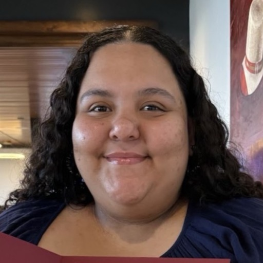
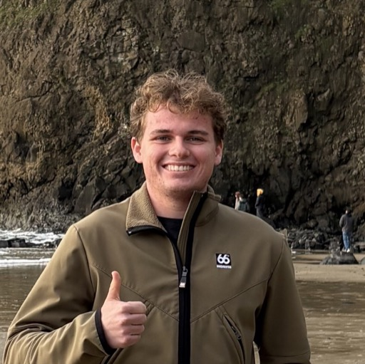

## Primary Investigator

  

    

  

    <a href="https://grahamedwards.github.io"><strong>Graham Harper Edwards</strong></a> <em>Assistant Professor</em> 
    Interests: glaciers, water, soils, meteorites, time

  

## Student Researchers

  

    

    
 <strong>Julio Melara</strong>  Interests: CaCO3, planetary health, education

  

  

    

    
 <strong>Erin Rodriguez</strong> Interests: minerals, volcanoes, metamorphic rocks, meandering rivers, paleoclimate, ostracods, geochemistry

  

  

    

    
 
      <strong>Ian Strang</strong> Interests: rocks, prehistoric landscapes and environments, bad jokes

  

  

### Alumni
<ul>
  <li>Emma <q>Rose</q> Garrett (2026)</li>
  <li>Luke Moreton (2026)</li>
  <li>Sophie Shipman (2026)</li>
</ul>

## Associates

  

    

    

      <strong>Chef Kennedy Edwards</strong> <em>Cat</em> 
      Interests: clay, kibble, rest, the hunt.
    

    

---
---

## Getting involved&hellip;

Are you a student interested in getting involved in current lab projects, or do you have an Earth/planetary/environmental chemistry idea you want to explore? I would love to hear it! Drop me a line at gedward1 [at] trinity.edu or stop by my office (234 [Marrs McLean Hall](https://www.trinity.edu/directory/spaces-places/marrs-mclean-hall#directions)). 

--- 