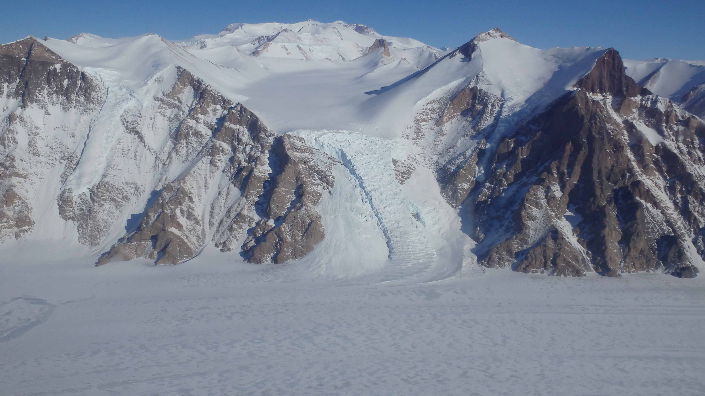

We study the interactions between ice, climate, and environments in Earth's history by studying materials formed that under/near ancient ice masses. 

<figure> <figcaption>A mountain glacier flowing into an ice field in West Antarctica.</figcaption></figure>

## Ice

<strong>Glaciers</strong>&mdash;perennial ice masses that flow under their own weight&mdash;and <strong>ice sheets</strong>&mdash;glaciers that span entire continents&mdash;are beatufiul components of our Earth system that play a powerful and sensitive role in our planet's climate.

### Subglacial systems

The <em>subglacial</em> environment, where ice meets rock and sediment, strongly controls the behavior of the overlying ice sheet. Yet, the beds of modern ice sheets are profoundly difficult to access, and deglacial processes typically obscure or destroy the beds of extinct ice sheets. Subglacial precipitates&mdash;mineralized salts from liquid subglacial waters&mdash;are chemical archives of subglacial hydrology across time and space. 

### Proglacial systems

Glaciers and ice sheets supply the <em>proglacial</em> landscapes in front of them with enormous amounts of sediments and meltwater. These proglacial environments develop lakes and wetlands that accumulate chemical and clastic sedimentary material, leaving a rich record of these ice-marginal landscapes. 

## Climate &amp; environmental change

We study sediments and chemical precipitates from sub- and proglacial environments to better understand how ice sheets and (nearby) periglacial environments have responded to changing climates. We examine patterns in sedimentation as well as [elemental](methods#elemental-analysis) and [isotopic](methods#mass-spectrometry) information encoded in precipitate minerals.

