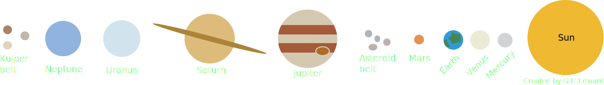
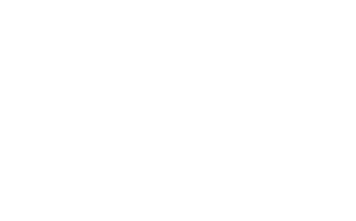

<em>Cosmochemistry</em> is the study of extraterrestrial materials (often meteorites) to understand the origins and evolution of our solar system (and beyond). In our cosmochemical work, we aim to characterize the composition and assembly of the earliest planetary bodies to better reconstruct the origins and evolution of the solar system.

## Early solar system history

Our modern solar system consists of a bright star (the Sun) at its center, orbited by a variety of rocky and icy bodies, including planets, asteroids, and Kuiper Belt Objects (which include comets). 

All of this formed from the collapse of an ancient cloud of gas and dust, through the process depicted below:

Shortly after the formation of the Sun, the first small planetary bodies, called planetesimals, formed from clumps of dust and became the building blocks of the planets and asteroids in our solar system today. Some of these bodies reached sizes exceeding 100 km (~60 miles) across, not nearly as large as the planets of the solar system today (Earth is ~13,000 km), but large enough that they were held together by their own gravity and could survive collisions with much smaller objects.

<figure style="width: 50%" class="align-right">
  
  <figcaption style="text-align:right;"> The ratio of radioactive 26Al to stable 27Al over time.  It was almost all gone after 5 million years (the solar system is almost 4,600 million years old).</figcaption>
</figure> 
These planetesimals were too small for the energy released by accretion to heat them, which happened to larger planets like Earth. However, they were large that it took them 10s of millions of years to cool off from the nuclear heating ofd radioactive isotopes within them. The short-lived radionuclide 26Al was the most important heat-producing isotope in the young solar system&mdash;its radiogenic heat drove melting in the earliest forming bodies that formed when 26Al was around. As 26Al radioactively decayed away, later-forming asteroids incorporated less 26Al and got hot but not hot enough to melt. The chondrite meteorites come from this latter group, while achondrites and irons derive from the earlier-forming melted and differentiated bodies. 

## Statistical cosmochemistry & astronomy
<figure style="width: 50%" class="align-left">
  
  <figcaption>Artist's depiction of a protoplanetary disk illuminated from within by a newborn star. [<a href="https://www.spitzer.caltech.edu/image/ssc2007-14d-planet-forming-disk-around-a-baby-star">NASA/JPL-Caltech/R. Hurt</a>]</figcaption>
</figure> 
Meteorites, fragments of the solar system’s first generations of planetesimals and relics of our solar system’s protoplanetary disk, provide the only samples of any stellar system available to study with laboratory methods. 
While extrasolar protoplanetary and debris disks may be observed remotely, meteorites alone afford the opportunity to study diverse disk materials with high analytical precision. 

We use computational methods, including statistical and numerical modeling techniques, to evaluate models of early solar system processes in the context of large cosmochemical datasets. 

## Water on asteroids

A recent study ([Turner+ 2021](https://doi.org/10.1126/science.abc8116)) reported evidence of recent hydrologic activity in asteroidal permafrosts, and sample return missions (e.g. [Lauretta+ 2024](https://doi-org.trinity.idm.oclc.org/10.1111/maps.14227)) confirm the watery histories of carbonaceous asteroids, such as Bennu (below). I am eager to use techniques honed in terrestrial permafrost and subglacial systems to further explore this emerging field of research.

